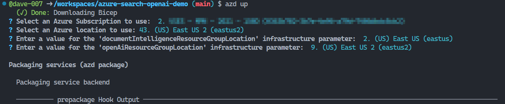
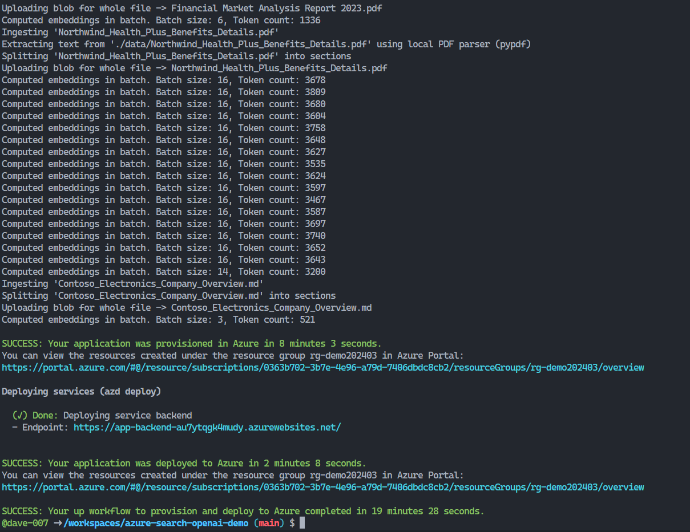

# Current Goal

## Exploring sample code about Azure AI features, specifically search

### Useful resources

- Talk, slides and sample code from Pamela Fox at Microsoft
> Her talk was amazingly helpful to understand about what AI Search has so many components.
> Check the description for the resources
  - https://www.youtube.com/watch?v=vuOA13Y_Qzk
- AZD Templates
  > Azure Developer CLI templates are becoming the preferred way for Microsoft folks to share useful sample code.
  - https://github.com/azure/awesome-azd
- List of GitHub repos that contain AZD templates
  - https://github.com/topics/azd-templates
- The [Azure Open AI Search Demo AZD Template](https://github.com/Azure-Samples/azure-search-openai-demo)

